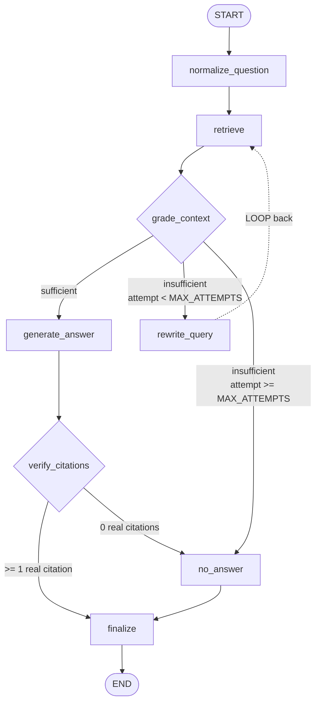

# LangGraph map

The flow is a `StateGraph` with **8 nodes**, **2 conditional branches**, **1 loop**, and
**2 independent limits**. Nothing is hidden inside a single giant LLM call: retrieval,
relevance grading, query rewriting, answering, and citation verification are separate
nodes with separate responsibilities.

Source: [`app/graph/build.py`](../app/graph/build.py) (wiring),
[`app/graph/nodes.py`](../app/graph/nodes.py) (node bodies),
[`app/graph/state.py`](../app/graph/state.py) (state).

## Diagram



## Nodes

| # | Node | What it does | LLM call? |
|---|---|---|---|
| 1 | `normalize_question` | Trims/validates the question, seeds `queries`, initialises `attempt`, `top_k`, `max_attempts`, trace. Rejects an empty question. | no |
| 2 | `retrieve` | Embeds the *current* query with the E5 instruct prefix, queries Pinecone `top_k`, merges hits into accumulated `context` deduped by `chunk_id` keeping the best score. | no |
| 3 | `grade_context` | **Branch decision.** Cheap deterministic pre-check (relevance floor), then a structured LLM grader returning `{sufficient, reason}`. One retry, then fails safe to `insufficient`. | yes |
| 4 | `rewrite_query` | **Bad path.** Produces one alternative phrasing using document vocabulary, increments `attempt`, loops back to `retrieve`. | yes |
| 5 | `generate_answer` | **Good path.** Renders context as numbered `[S1]…[Sn]` blocks with full chunk text, answers under strict grounding rules. Retries once if the model omits markers entirely. | yes |
| 6 | `verify_citations` | Maps every `[S#]` back to a real retrieved chunk. Drops whole sentences carrying fabricated markers. Zero surviving citations → `no_answer`. | no |
| 7 | `no_answer` | Canonical refusal, `status="not_found"`, empty citations, records which queries were searched. | no |
| 8 | `finalize` | Sets final status and closes the trace. | no |

## The branch

`route_after_grade` in [`app/graph/nodes.py`](../app/graph/nodes.py) is a three-way branch,
not a binary one:

```python
def route_after_grade(state):
    if state["grade"] == "sufficient":
        return "generate_answer"          # good path
    if state["attempt"] < state["max_attempts"]:
        return "rewrite_query"            # bad path -> retry loop
    return "no_answer"                    # bad path -> give up cleanly
```

A second branch, `route_after_verify`, sends the request to `no_answer` if citation
verification left nothing real to stand on.

## The two limits

Deliberately belt-and-braces, because they fail differently:

1. **`MAX_ATTEMPTS` (default 2)** — the *semantic* cap, enforced in `route_after_grade`.
   Worst case is 3 retrievals (1 initial + 2 rewrites) then a clean refusal. Tunable via
   the `MAX_ATTEMPTS` env var.
2. **`recursion_limit`** — the *structural* backstop passed to `.invoke()`. If a future
   edge-wiring bug created a real cycle, this surfaces it as a caught
   `GraphRecursionError` → HTTP 500 with a clear message, rather than a hung request.

The limit is **derived, not hardcoded**:

```python
recursion_limit_for(max_attempts) = 3 * max_attempts + 8
```

The worst path visits `5 + 3*max_attempts` nodes. An earlier hardcoded `12` fit
`MAX_ATTEMPTS=2` (11 steps) by exactly one step, and broke at `MAX_ATTEMPTS=3` (14 steps)
— turning a graceful refusal into an HTTP 500. `tests/test_graph_branch.py` asserts the
derived limit covers attempts 1–5.

## Why citation verification is its own node

The scoring rubric asks "any fake citations?". Prompting alone makes fabrication *unlikely*;
node 6 makes it *structurally impossible* to return one:

- Every `[S#]` is resolved against the exact chunks passed to the model.
- An unresolvable marker means the whole sentence is dropped — not just the marker.
  Stripping only the marker would leave a hallucinated claim in the answer with **no**
  citation at all, which is worse than a visible fake one.
- If nothing survives, the graph routes to `no_answer` rather than returning an
  ungrounded assertion.

## State

`AskState` ([`app/graph/state.py`](../app/graph/state.py)) is a `TypedDict`. Two fields use
additive reducers (`Annotated[list, operator.add]`) so any node can append without
read-modify-write:

- `queries` — the original question plus every rewrite actually tried
- `trace` — one entry per node visit, with timings, scores, and the grade reason

Everything else (`context`, `grade`, `answer`, `citations`, `status`, …) overwrites
normally. Pass `"include_trace": true` to `POST /ask` to see the trace in the response —
this is the quickest way to watch the branch and loop fire.

## Dependency injection

`GraphDeps` holds the retriever and both chat models. Production wiring lives in
`build_production_deps()`; tests inject a stub retriever and stub chat models, so
`tests/test_graph_branch.py` exercises the entire graph — branch, loop cap, citation
stripping — with **no network and no API keys**.
